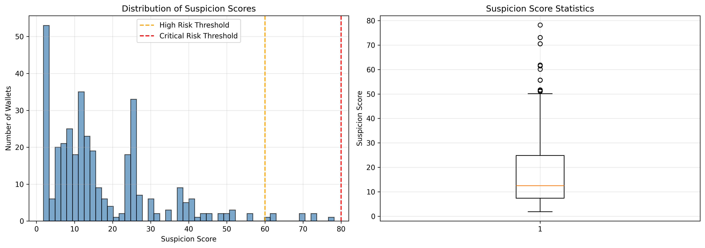
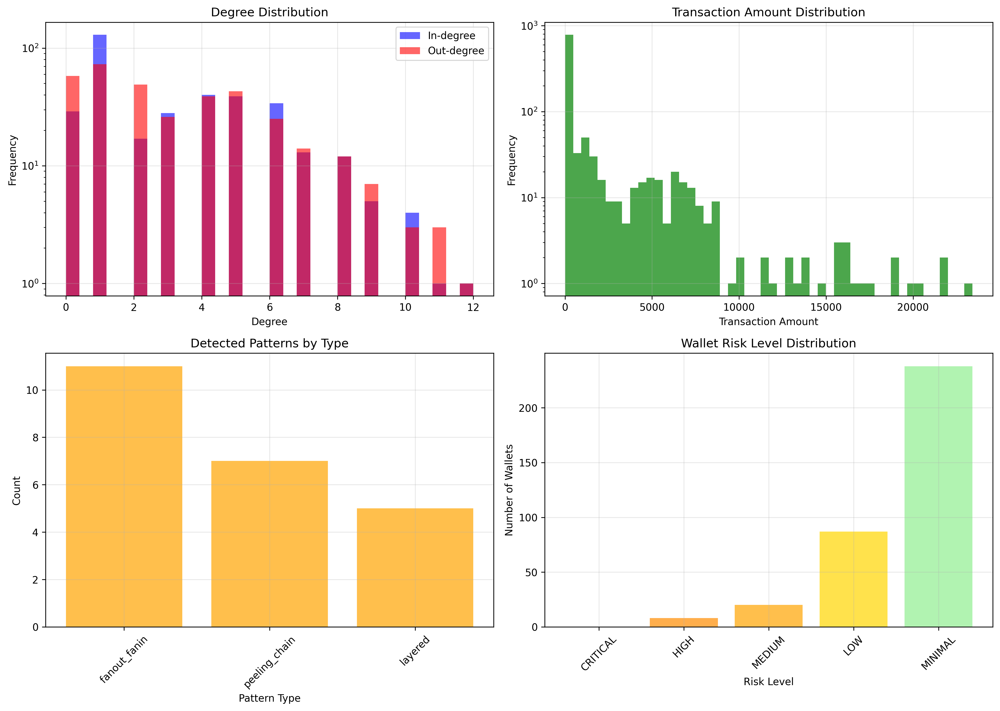
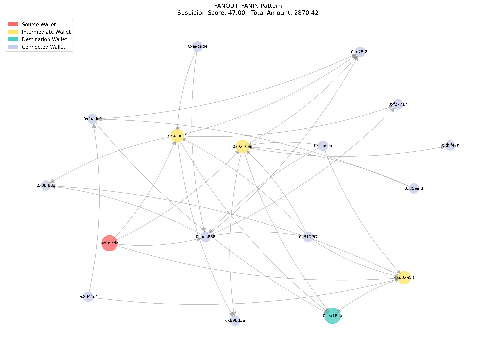

# Smurfing Hunter: Money Laundering Detection System

**Domain**: RegTech / Crypto-Forensics / Graph Theory  
**Solution Type**: Graph Analysis & Pattern Recognition System

---

## 🚀 Problem Statement

Decentralized Finance (DeFi) allows for anonymous transfers, but regulators require compliance with Anti-Money Laundering (AML) laws. A common laundering technique is **"Smurfing"** or **"Layering,"** where a large sum of dirty money is broken into hundreds of small transactions (fan-out), passed through multiple intermediate wallets (layering), and then re-aggregated (fan-in).

**Challenges addressed:**
1.  **Topology Identification**: Detecting "Fan-out / Fan-in", "Cyclic", and "Gather-Scatter" patterns.
2.  **Obfuscation Breaking**: Identifying "Peeling Chains" and accounting for time delays/amount variations.

---

## 💡 Solution Overview

**Smurfing Hunter** is a comprehensive Python-based forensic tool that detects, analyzes, and visualizes money laundering patterns in blockchain transaction networks.

### Technical Stack
-   **Core**: `Python 3.8+`
-   **Graph Processing**: `NetworkX` (Directed Graph Analysis)
-   **Data Processing**: `Pandas`, `NumPy`
-   **Visualization**: `PyVis` (Interactive), `Matplotlib` (Static)
-   **Statistics**: `SciPy` (Z-score anomaly detection)

### Key Features (Eval Ready)
1.  **Pattern Detection Engine**:
    -   **Fan-out/Fan-in**: Identifies split and merge topologies with *Temporal Validation* (Time $t_1 < t_2$).
    -   **Peeling Chains**: Detects sequential small withdrawals used to hide significant funds (Obfuscation Breaking).
    -   **Cyclic Graphs**: Finds money flowing in loops to obscure origin.
    -   **Layered Laundering**: Traces multi-hop paths from known illicit sources.

2.  **Suspicion Scoring Model (0-100)**:
    -   Calculates a risk score based on:
        -   **Centrality**: PageRank & Betweenness (Network importance).
        -   **Illicit Proximity**: Geodesic distance to known bad actors.
        -   **Pattern Involvement**: Participation in detected laundering schemes.
        -   **Structural Anomalies**: Statistical outliers in transaction behavior.

3.  **Visualization Dashboard**:
    -   Interactive HTML graph with risk hotspots.
    -   Static reports of detected patterns.
    -   Distribution plots of suspicion scores.

---

## 🛠️ Installation

```bash
# 1. Clone the repository
git clone <repo-url>
cd smurfing-hunter

# 2. Create virtual environment (Optional but Recommended)
python -m venv venv
source venv/bin/activate  # Windows: venv\Scripts\activate

# 3. Install dependencies
pip install -r requirements.txt
```

---

## ⚡ Usage

### Quick Start (Verification Demo)
Run the complete end-to-end demonstration. This generates sample data, detects patterns, and builds the dashboard.

```bash
python scripts/run_demo.py
```
*Expected Output*: ~24 patterns detected, Risk Report generated, 5+ visualization files.

### Analyze Your Own Data
```bash
python run.py --transactions data/transactions.csv --illicit data/illicit_wallets.csv --output results
```

### Investigate Specific Wallet
```bash
python run.py --investigate 0x123abc...
```

---

## 📊 Results & Outcomes

The system produces a comprehensive `output/` directory containing:

1.  **`risk_report.txt`**: Detailed assessment of top suspicious wallets.
    -   *Example*: "Wallet 0x8f2... | Score: 92.5 (CRITICAL) | Involved in 3 Peeling Chains"
2.  **`visualizations/full_graph.html`**: Interactive network map.
    -   🔴 Red nodes: Known Illicit
    -   🟠 Orange nodes: High Risk (Score > 60)
3.  **Pattern Plots**: PNG images of every detected laundering topology.

---

## 📸 Sample Visualizations

Below are actual outputs generated by `scripts/run_demo.py` from the provided `demo_results/`.

### 1. Risk Score Distribution

*Distribution of wallet suspicion scores showing separation between normal and high-risk wallets.*

### 2. Network Statistics

*Key graph metrics including degree distribution and centrality measures.*

### 3. Detected Smurfing Patterns
**Fan-out / Fan-in Pattern:**


**Cyclic / Layered Pattern:**


---

## 📂 Project Structure

```text
.
├── src/
│   └── smurfing_hunter/
│       ├── core/
│       │   ├── smurfing_hunter.py   # Main analysis logic
│       │   ├── pattern_detector.py  # Pattern detection engine
│       │   ├── suspicion_scorer.py  # Risk scoring algorithm
│       │   └── graph_builder.py     # Graph construction
│       ├── utils/
│       │   └── visualizer.py        # Dashboard generation
│       └── data/
│           └── generate_sample_data.py
├── scripts/
│   └── run_demo.py              # End-to-end demonstration script
├── data/                        # Data directory (created on run)
│   ├── transactions.csv
│   └── illicit_wallets.csv
├── run.py                       # Main CLI entry point
├── requirements.txt             # Dependencies
├── README.md                    # Documentation
├── EVALUATION_DOSSIER.md        # Rubric-mapped project details
└── demo_results/                # Example outputs
```
